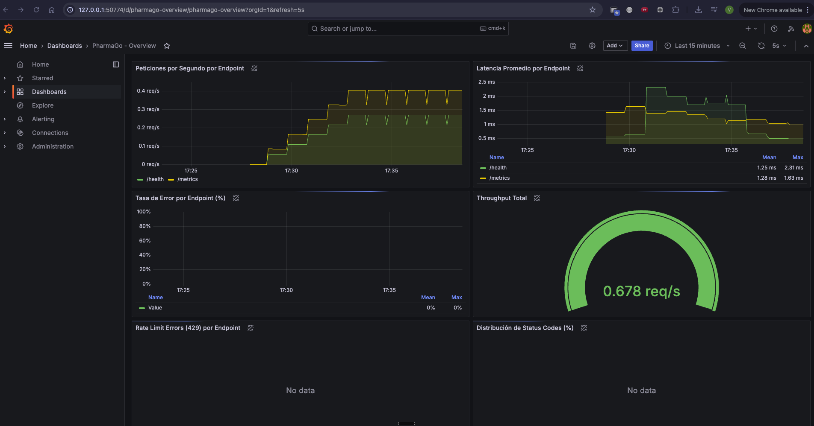
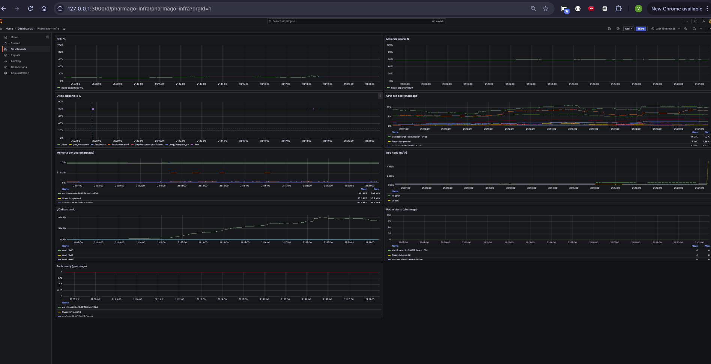
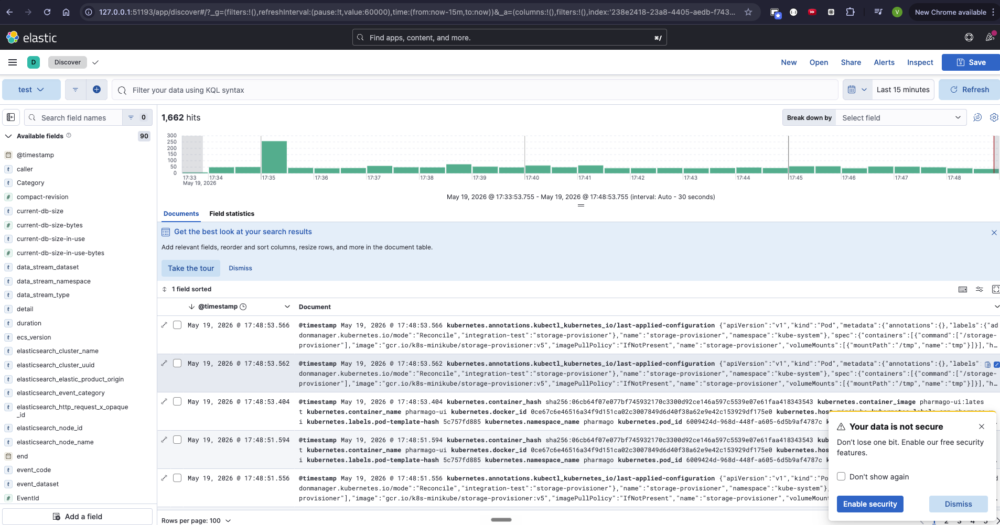
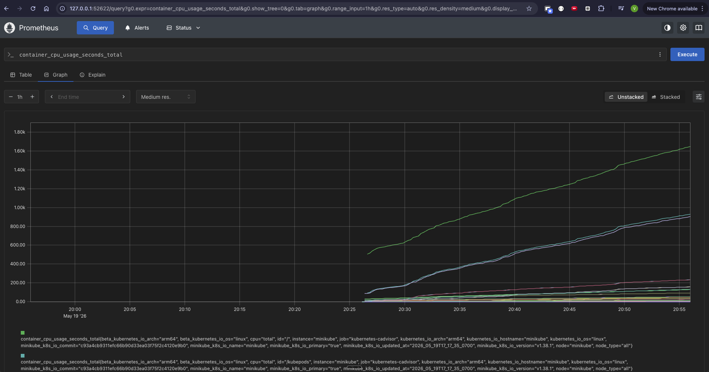

# Telemetria - Checklist de requerimientos

## Logs estructurados en JSON

| Requerimiento | Estado | Detalle |
|---|---|---|
| Logs en formato JSON | OK | .NET Console JSON formatter en los 3 microservicios (`appsettings.json`) |
| Campos estructurados (timestamp, level, service) | OK | `StructuredLogger.cs` agrega `timestamp_utc`, `level`, `service`, `correlation_id` |
| Eventos de negocio con tokens | OK | Tokens como `EVTLGOK` (login), `EVTPUCR` (purchase), etc. |
| Recoleccion de logs | OK | Fluent Bit como DaemonSet, parsea JSON de .NET y envia a Elasticsearch |
| Consulta de logs en Kibana | OK | Index pattern `pharmago-logs-*`, campos buscables via KQL |

## Trazas OTLP

| Requerimiento | Estado | Detalle |
|---|---|---|
| Propagacion de contexto | OK | `X-Correlation-ID` generado en API Gateway y propagado a servicios via YARP |
| Correlation ID en logs | OK | Incluido como campo `correlation_id` en todos los logs JSON |
| OTLP Collector recibe telemetria | OK | gRPC en puerto 4317 |
| Pipeline de traces en collector | FALTA | El collector solo tiene pipeline de metricas, no exporta traces a ningun backend |
| Backend de traces (Jaeger/Zipkin) | FALTA | No hay componente desplegado para almacenar/visualizar traces |

## Metricas de aplicacion (minimo 5)

| # | Metrica | Tipo | Estado |
|---|---|---|---|
| 1 | `login_invocations` | Counter | OK |
| 2 | `pharmago_http_requests_total` | Counter (endpoint/method/status) | OK |
| 3 | `pharmago_http_errors_total` | Counter (endpoint/error_type) | OK |
| 4 | `request_duration` | Histogram (ms) | OK |
| 5 | `pharmago_http_request_duration_milliseconds` | Histogram (endpoint/method) | OK |
| 6 | `active_user_count` | Gauge | OK |

## Metricas de infraestructura - nodo (minimo 5)

| # | Metrica | Query PromQL | Fuente | Dashboard |
|---|---|---|---|---|
| 1 | CPU usage % | `100 - (avg by (instance) (rate(node_cpu_seconds_total{mode="idle"}[5m])) * 100)` | Node Exporter | Pre-existente |
| 2 | Memoria usada % | `(1 - (node_memory_MemAvailable_bytes / node_memory_MemTotal_bytes)) * 100` | Node Exporter | Pre-existente |
| 3 | Disco disponible % | `(node_filesystem_avail_bytes{fstype!~"tmpfs\|overlay"} / node_filesystem_size_bytes) * 100` | Node Exporter | Pre-existente |
| 4 | Red recibida/enviada | `rate(node_network_receive_bytes_total[5m])` / `rate(node_network_transmit_bytes_total[5m])` | Node Exporter | Agregado |
| 5 | I/O disco | `rate(node_disk_read_bytes_total[5m])` / `rate(node_disk_written_bytes_total[5m])` | Node Exporter | Agregado |

## Metricas de infraestructura - pod/contenedor (minimo 5)

| # | Metrica | Query PromQL | Fuente | Dashboard |
|---|---|---|---|---|
| 1 | CPU por pod | `sum by (pod) (rate(container_cpu_usage_seconds_total{namespace="pharmago"}[5m])) * 100` | cAdvisor | Pre-existente |
| 2 | Memoria por pod | `sum by (pod) (container_memory_working_set_bytes{namespace="pharmago"})` | cAdvisor | Pre-existente |
| 3 | Pod restarts | `increase(kube_pod_container_status_restarts_total{namespace="pharmago"}[5m])` | kube-state-metrics | Agregado (nuevo componente) |
| 4 | Pods ready | `kube_pod_status_ready{namespace="pharmago",condition="true"}` | kube-state-metrics | Agregado (nuevo componente) |
| 5 | Red rx/tx por pod | `sum by (pod) (rate(container_network_receive_bytes_total{namespace="pharmago"}[5m]))` | cAdvisor | Disponible en Prometheus |

## Recoleccion y visualizacion

| Requerimiento | Estado | Detalle |
|---|---|---|
| Metricas recolectadas con OTLP | OK | Servicios exportan via OTLP gRPC al collector, que expone en :8889 |
| Prometheus scraping | OK | Scrape cada 5s a: otel-collector, 3 servicios, node-exporter, cadvisor, kube-state-metrics |
| Retencion Prometheus | OK | 30 dias |
| Dashboard Grafana - aplicacion | OK | `pharmago-overview.json`: requests/s, latencia, error rate, throughput, 429s, status codes |
| Dashboard Grafana - infra | OK | `pharmago-infra.json`: CPU/memoria/disco/red/IO nodo, CPU/memoria por pod, pod restarts, pods ready |
| Logs en Elasticsearch | OK | Elasticsearch 8.11, indices `pharmago-logs-YYYY.MM.DD` |
| Logs consultables en Kibana | OK | Kibana 8.11, data view `pharmago-logs-*` |

### Dashboard Grafana - Overview

### Dashboard Grafana - Infra

### Kibana - Discover (logs estructurados)

### Prometheus - Query (container_cpu_usage_seconds_total)

## Alertas en Grafana (minimo 5)

| # | Alerta | Estado |
|---|---|---|
| 1 | - | FALTA |
| 2 | - | FALTA |
| 3 | - | FALTA |
| 4 | - | FALTA |
| 5 | - | FALTA |

## Resumen

| Categoria | Estado |
|---|---|
| Logs estructurados JSON | OK |
| Trazas OTLP | PARCIAL - falta pipeline de traces en collector |
| Metricas aplicacion (5+) | OK (6 metricas) |
| Metricas infra nodo (5+) | OK (Node Exporter) |
| Metricas infra pod (5+) | OK (cAdvisor + kube-state-metrics) |
| OTLP -> Prometheus -> Grafana | OK |
| Logs en Kibana + ES | OK |
| 5 alertas en Grafana | FALTA |
